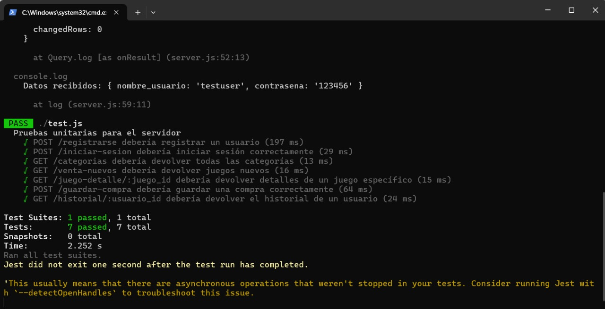
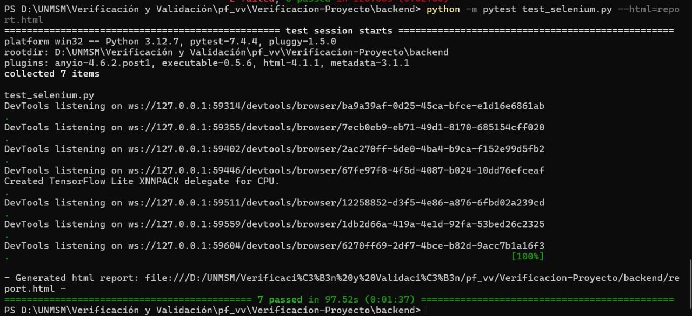
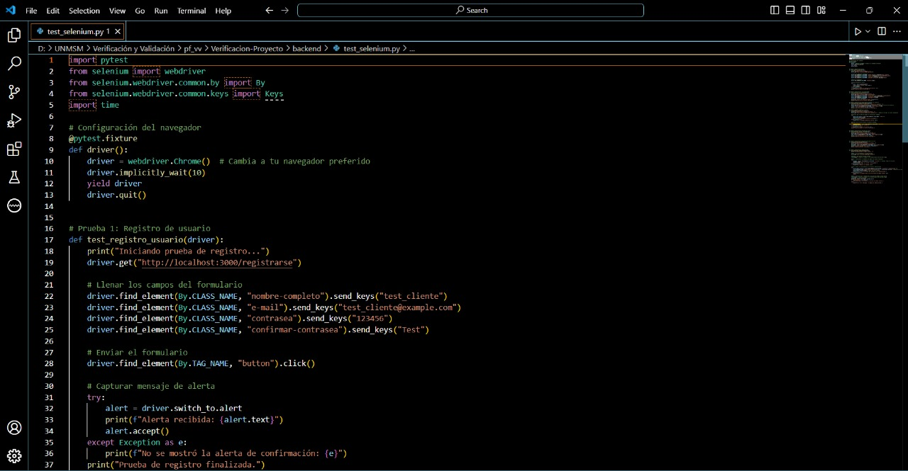
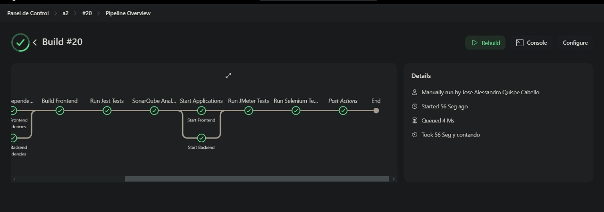
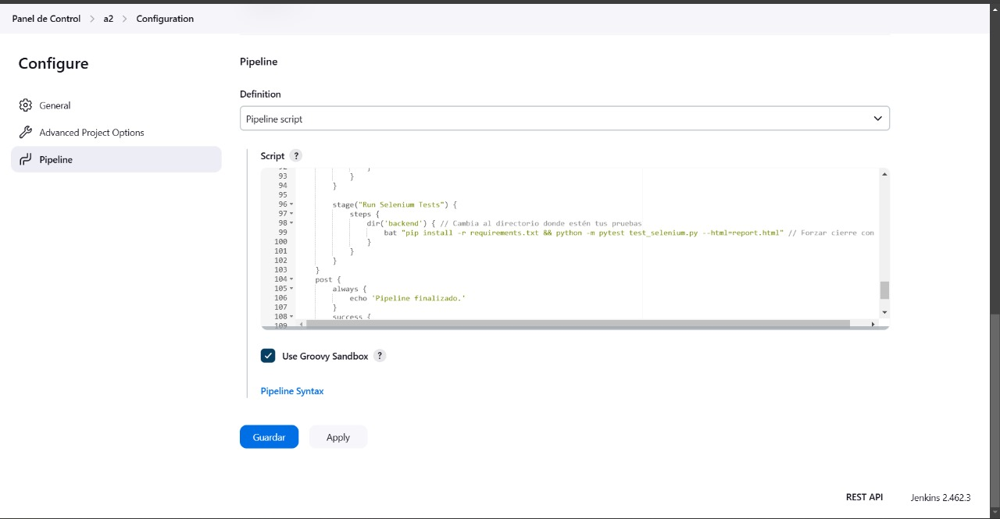
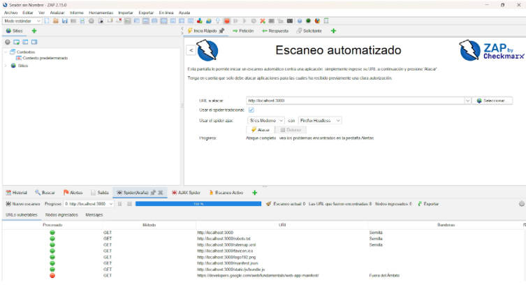
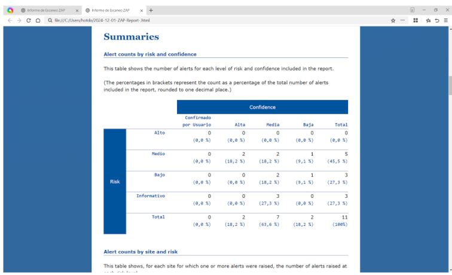
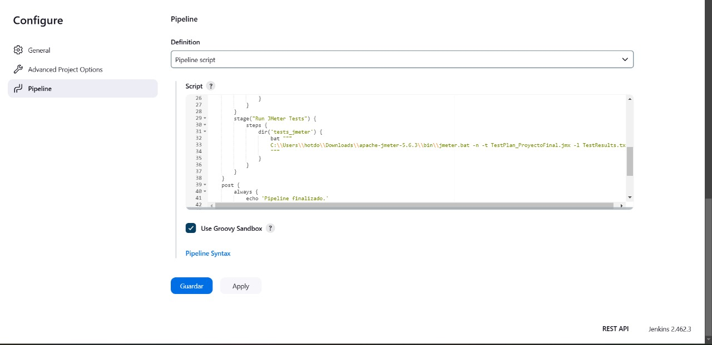
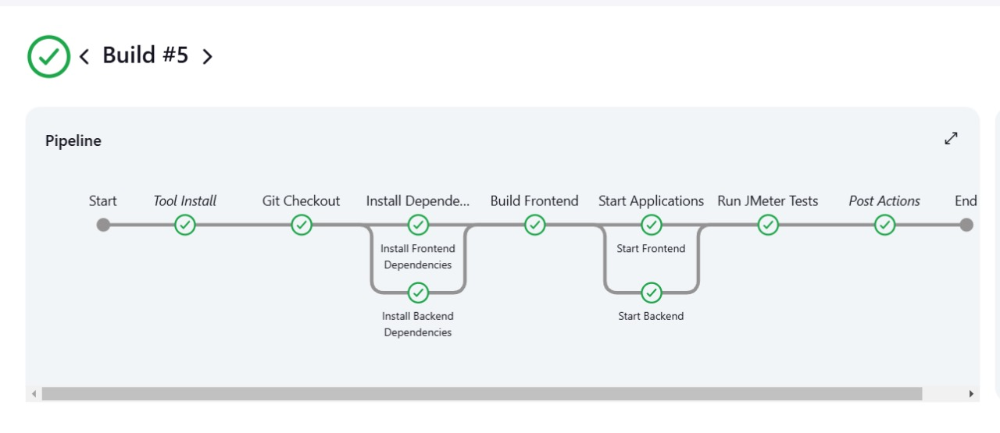

# Integrantes:
- Sanchez Wong, Jatziry
- Quispe Cabello, Jose
- Mirano Surquislla, Fiorella

# Plataforma de Compra y Venta de Videojuegos

## Propósito del Proyecto
Este proyecto busca facilitar la compra y venta de videojuegos nuevos y de segunda mano mediante una plataforma en línea que sea fácil de usar, segura y accesible. La meta es conectar a gamers de todas partes para que puedan intercambiar, vender o adquirir videojuegos de manera conveniente.

## Objetivo
Desarrollar una plataforma interactiva que permita:
- **Compradores**: Encontrar videojuegos a precios competitivos, ya sean nuevos o de segunda mano.
- **Vendedores**: Publicar videojuegos para su venta de manera rápida y sencilla.
- Garantizar un proceso de compra-venta **transparente y seguro** mediante opciones confiables de pago y seguimiento de envíos.

## Objetivo de las Pruebas 
Garantizar que el software cumpla con los requisitos funcionales y no funcionales definidos, detectando defectos y validando que el producto sea confiable, eficiente y de calidad antes de su implementación o entrega

## Características Principales

- **Catálogo amplio con filtros por precio y género.**
  
  
  

  
- **Vista de la sección de venta de videojuegos**
  
  

  
  
- **Vista de la sección de pago**
  
  
---

# Pipeline
## Construcción Automática
- **Herramienta**: Node Package Manager
  

**1. Etapa: Install Dependencies**
- Objetivo: Instalar las dependencias necesarias tanto para el frontend como para el backend del proyecto.
- Ejecución paralela:
    Subetapa: Install Frontend Dependencies
  
      Navega al directorio del frontend (fronted) y ejecuta el comando npm install para descargar e instalar todas las dependencias definidas en el archivo package.json del frontend.
  
    Subetapa: Install Backend Dependencies
  
      Navega al directorio del backend (backend) y ejecuta el comando npm install para instalar las dependencias del backend.
**2. Etapa: Build Frontend**
- Objetivo: Construir los archivos del frontend para producción.
- Ejecución:
    Cambia al directorio del frontend (fronted) y ejecuta el comando npm run build.
Este comando generalmente compila, minimiza y optimiza los archivos del frontend para su despliegue en un entorno de producción, según lo definido en el script build del package.json.

- **Evidencia**:
  
  
  
- **Integración con Jenkins**:

  
  
## Análisis Estático
- **Herramienta**: SonarQube
  
- **Evidencia**:

  
- **Integración con Jenkins**:

  
## Pruebas Unitarias
- **Herramienta**: Para realizar las pruebas unitarias del servidor, se utilizó Jest, un marco de prueba en JavaScript ampliamente utilizado para aplicaciones basadas en Node.js. Jest ofrece un entorno robusto y fácil de configurar que permite ejecutar pruebas automatizadas con alta velocidad y fiabilidad.

### Pruebas ejecutadas y resultados:
- POST /registrarse

  **Resultado esperado:** Registrar un nuevo usuario correctamente y devolver un mensaje de éxito.
  
  **Resultado obtenido:** Prueba superada. El servidor respondió con un estado 200 y el mensaje esperado, confirmando que el usuario fue registrado correctamente. 
- POST /iniciar-sesion
  
  **Resultado esperado:** Autenticar al usuario y devolver su usuario_id.
  
  **Resultado obtenido:** Prueba superada. La autenticación funcionó, y el servidor devolvió un estado 200 junto con el usuario_id.
- GET /categorias
  
  **Resultado esperado:** Devolver un array con las categorías disponibles.
  
  **Resultado obtenido:** Prueba superada. El servidor devolvió un estado 200 y un array válido.
- GET /venta-nuevos
  
  **Resultado esperado:** Proporcionar una lista de juegos nuevos en venta.
  
  **Resultado obtenido:** Prueba superada. La respuesta incluyó un array con juegos nuevos y un estado 200.
- GET /juego-detalle/:juego_id

  **Resultado esperado:** Proporcionar detalles de un juego específico, como título y precio.
  
  **Resultado obtenido:** Prueba superada. Se devolvieron los detalles esperados del juego y el estado 200.
- POST /guardar-compra
  
  **Resultado esperado:** Guardar una compra en la base de datos y devolver un mensaje de éxito.
  
  **Resultado obtenido:** Prueba superada. La compra fue guardada exitosamente con el mensaje correspondiente y un estado 200.
- GET /historial/:usuario_id

  **Resultado esperado:** Proveer el historial de compras de un usuario en formato de array.
  
  **Resultado obtenido:** Prueba superada. El historial del usuario se devolvió correctamente.

**Comandos:**
- Pruebas JEST:npm test

### Mensajes de consola:
Los mensajes de consola proporcionan información útil para depuración y confirmación:

- El servidor está ejecutándose correctamente en el puerto 3001.
- El registro y la autenticación de usuario muestran los datos enviados y los resultados correspondientes.
- La conexión a la base de datos fue exitosa, y las operaciones relacionadas (INSERT, consultas) se completaron sin errores.
  
   

### **Resumen:**
- Pruebas: 7/7 completadas con éxito.
- Estado del servidor y base de datos: Todos los endpoints y las funcionalidades básicas (registro, inicio de sesión, consultas y compras) funcionan correctamente según las pruebas unitarias.
- Tiempo total: 2.252 segundos.
  
**Evidencia**:

  

**Integración con Jenkins**:

  
  
## Pruebas Funcionales
  - **Herramienta**: Selenium
  ### Prueba de Registro de Usuario:
  - Se llenaron los campos del formulario de registro y se verificó la aparición de la alerta de confirmación.
  ### Prueba de Simulación de Inicio de Sesión:
  - Se simula el inicio de sesión con credenciales de prueba, y se verificó la URL de la página después del inicio.
  ### Prueba de Exploración de Detalles de Producto:
  - Se visitó la página de un producto y se verificó la visualización de su título.
  ### Prueba de Agregar Producto al Carrito:
  - Se verificó si el producto se podía agregar al carrito y si el carrito se mostró correctamente.
  ### Prueba de Revisión del Carrito:
  - Se visitó la página del carrito y se verificó que el total del carrito se mostrara correctamente.
  ### Prueba de Aplicación de Descuento en el Carrito:
  - Se verificó si el descuento aplicado en el carrito se reflejó correctamente.
  ### Prueba de Compra Exitosa:
  - Se simuló una compra exitosa, seleccionando el checkbox para pagar con tarjeta y haciendo clic en el enlace para proceder al pago.
  
  Luego, se verificó que la redirección a la página /compra-exitosa ocurriera correctamente.
  
  **Comando:**
  
  Pruebas Selenium: thon -m pytest test_selenium.python --html=report.html
  ### Resultados de las Pruebas:
  - Estado: Todas las pruebas pasaron con éxito. ✅
  - Duración: Las pruebas se ejecutaron en un tiempo total de 97.52 segundos.
  
  Las pruebas han validado todas las funcionalidades críticas del sistema, simulando el comportamiento de un usuario real desde el registro hasta la compra exitosa. Cada paso fue automatizado con Selenium,       asegurando que las funcionalidades respondieran como se esperaba en diferentes escenarios (registro, inicio de sesión, carrito, pago, etc.).
  El hecho de que todas las pruebas hayan pasado con éxito significa que la aplicación responde correctamente a las interacciones simuladas y que las funcionalidades clave están implementadas de manera adecuada.

**Evidencia**:
  

  
  
**Integración con Jenkins**:

  
## Pruebas de Seguridad
- **Herramienta**: OWASP ZAP
  
- **Evidencia**:
  
  

  
  
## Pruebas de Performance
- **Herramienta**: Se realizaron pruebas de rendimiento utilizando Apache JMeter con el objetivo de evaluar el comportamiento del sistema bajo carga simulada. Las pruebas fueron diseñadas para medir tiempos de respuesta, estabilidad y capacidad de procesamiento del sistema frente a múltiples solicitudes concurrentes.

### Configuración de las Pruebas
A continuación, se describe la configuración empleada:

**Grupo de Hilos (Thread Group)**
- Número de Hilos (Usuarios simulados): 100
- Periodo de Subida: 10 segundos
- Iteraciones: 1
- Acción en caso de error: Continuar con la ejecución de las solicitudes.
- Usuario por Iteración: Configurado para mantener el mismo usuario en cada iteración.
### Componentes Utilizados
#### HTTP Request Samplers:
- Simulan solicitudes HTTP hacia los endpoints del sistema bajo prueba.
- Configurados para diferentes escenarios, como:
- Registro de usuario.
- Inicio de sesión.
- Visualización de productos.
- Consultas de estados y ventas.
#### HTTP Header Manager:
- Configurado para establecer el puerto predeterminado del servidor (localhost).
#### Duration Assertion:
- Agregado a cada sampler para verificar que los tiempos de respuesta cumplan con los umbrales establecidos.
#### Listeners:

- **View Results Tree:** Utilizado para inspeccionar el comportamiento de las solicitudes durante las pruebas.
- **Summary Report:** Para generar estadísticas agregadas del rendimiento del sistema.
### Exportación de Resultados:
Los resultados se almacenaron en un archivo CSV para su posterior análisis y la generación de reportes en formato HTML.
### Ejecución de las Pruebas

Durante la ejecución, se simuló un tráfico de 100 usuarios concurrentes distribuidos uniformemente durante 10 segundos. Las pruebas se centraron en medir:
- Tiempos de respuesta de las solicitudes.
- Tasas de error.
- Rendimiento general del sistema bajo carga.

### Resultados
- El reporte completo de los resultados de las pruebas de rendimiento se encuentran en la carpeta results dentro de la carpeta test_jmeter. Se generó reporte HTML.

**Evidencia**:
    
    
**Integración con Jenkins**:

  
