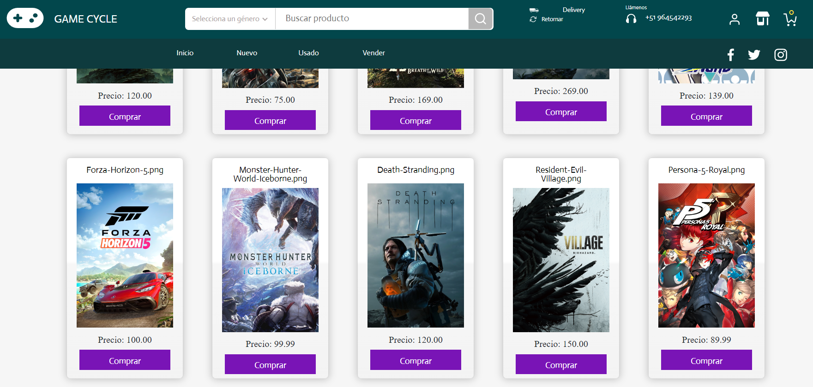
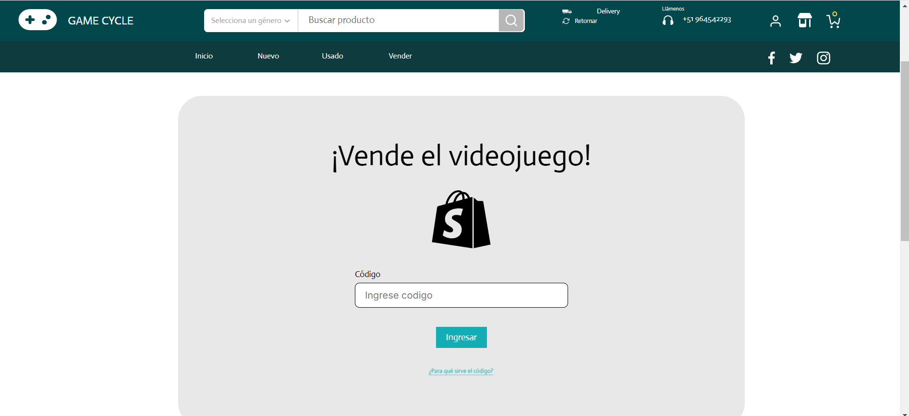
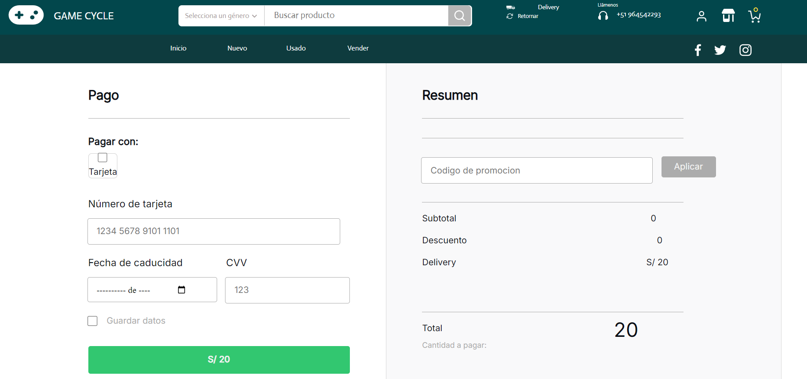
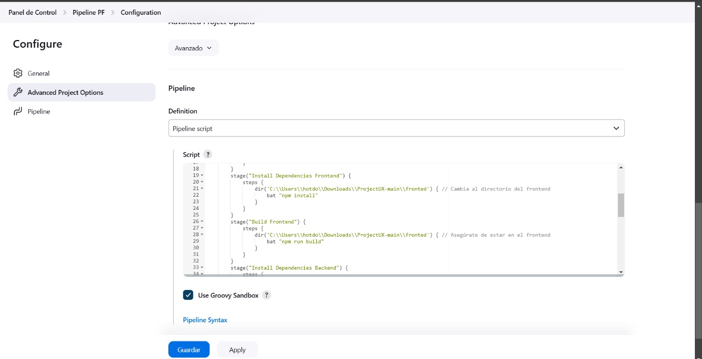
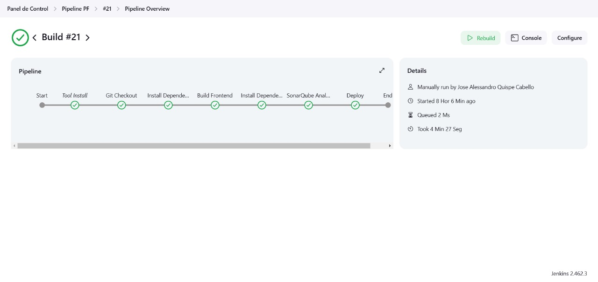
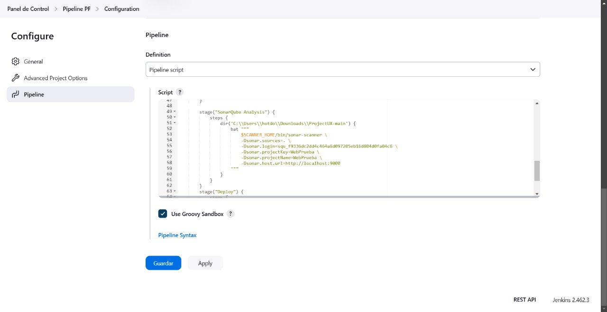
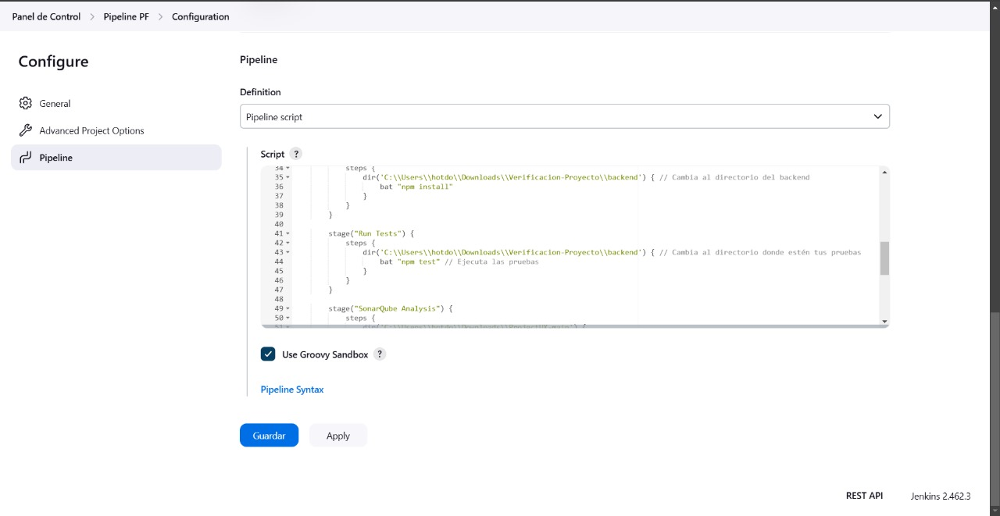
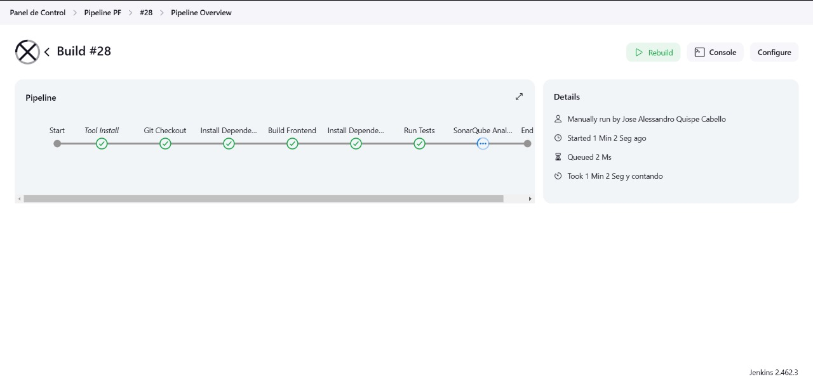

# Integrantes:
- Sanchez Wong, Jatziry
- Quispe Cabello, Jose
- Mirano Surquislla, Fiorella

# Plataforma de Compra y Venta de Videojuegos

## Propósito del Proyecto
Este proyecto busca facilitar la compra y venta de videojuegos nuevos y de segunda mano mediante una plataforma en línea que sea fácil de usar, segura y accesible. La meta es conectar a gamers de todas partes para que puedan intercambiar, vender o adquirir videojuegos de manera conveniente.

## Objetivo
Desarrollar una plataforma interactiva que permita:
- **Compradores**: Encontrar videojuegos a precios competitivos, ya sean nuevos o de segunda mano.
- **Vendedores**: Publicar videojuegos para su venta de manera rápida y sencilla.
- Garantizar un proceso de compra-venta **transparente y seguro** mediante opciones confiables de pago y seguimiento de envíos.

## Características Principales

- **Catálogo amplio con filtros por precio y género.**
  
  
- **Vista de la sección de venta de videojuegos**
  
  
- **Vista de la sección de pago**
  
---

# Pipeline
## Construcción Automática
- **Herramienta**: Node Package Manager
- **Evidencia**: 
- **Integración con Jenkins**: 
## Análisis Estático
- **Herramienta**: SonarQube
- **Evidencia**: 
- **Integración con Jenkins**: 
## Pruebas Unitarias
- **Herramienta**: Jest
- **Evidencia**: 
- **Integración con Jenkins**: 
## Pruebas Funcionales
- **Herramienta**: Selenium
- **Evidencia**:
- **Integración con Jenkins**:
## Pruebas de Seguridad
- **Herramienta**: OWASP ZAP
- **Evidencia**:
- **Integración con Jenkins**:
## Pruebas de Performance
- **Herramienta**: JMeter
- **Evidencia**:
- **Integración con Jenkins**:
